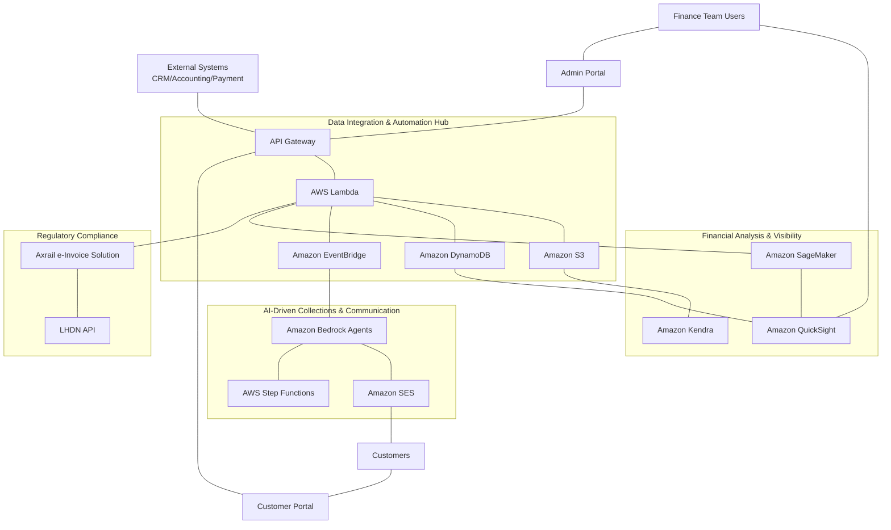
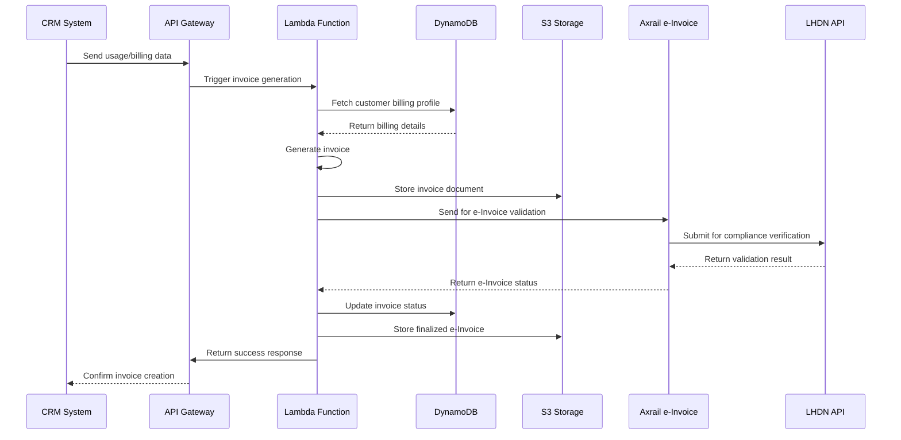
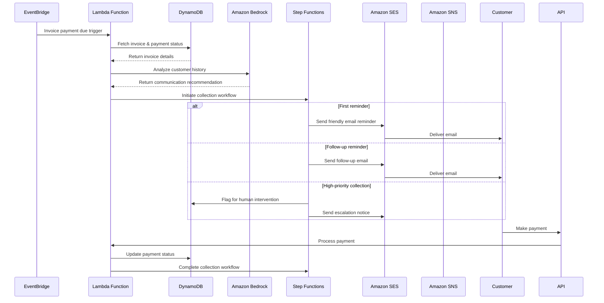
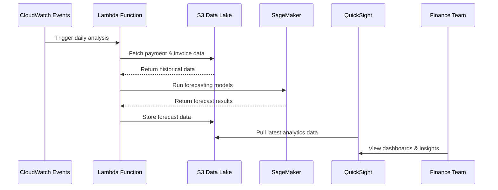

# Technical Proposal: Finnovate AI

## Executive Summary

Finnovate AI is an automated, AI-driven solution designed to streamline the entire "invoice-to-cash" process for B2B SaaS companies. This proposal outlines the technical implementation approach for building this platform using AWS services, with a focus on addressing the key pain points identified:

1. Fragmented billing systems requiring manual intervention
2. Inconsistent follow-up processes for overdue payments
3. Poor visibility into customer payment patterns
4. Manual reconciliation between usage data and billing
5. Compliance with Malaysia's e-Invoicing regulations (July 2025 deadline)

## System Architecture Overview

The Finnovate AI platform will be built as a cloud-native application on AWS, utilizing a serverless architecture wherever possible to minimize operational overhead and maximize scalability. The system consists of four key components:

1. **Data Integration and Automation Hub**
2. **AI-Driven Collections and Communication Engine**
3. **Financial Analysis and Visibility Platform**
4. **Regulatory Compliance Framework**

### High-Level Architecture Diagram

## Key System Interactions

### 1. Invoice Generation Process

The following sequence diagram illustrates the automated invoice generation process:

### 2. AI-Driven Collections Process

The following sequence diagram illustrates how the system handles collections and follow-ups:

### 3. Financial Analysis and Forecasting

## Technical Implementation Details

### 1. Data Integration and Automation Hub

#### Amazon API Gateway
- **Implementation**: Create RESTful APIs for each integration point (CRM, accounting, payment systems)
- **Configuration**: Set up API keys, throttling, and usage plans for each external system
- **Integration**: Use Lambda proxy integration for maximum flexibility

#### AWS Lambda
- **Implementation**: Develop specialized functions for:
  - Invoice generation based on usage data
  - Payment processing and reconciliation
  - Workflow orchestration
  - Data transformation between systems
- **Languages**: Node.js for lightweight transformations, Python for complex processing
- **Environment**: Configure with appropriate memory and timeout settings based on task complexity

#### Amazon S3
- **Implementation**: Create buckets for:
  - Invoice documents (PDF/HTML)
  - Supporting financial documentation
  - Audit trails
  - Data lake for analytics
- **Configuration**: Set up appropriate lifecycle policies, encryption, and access controls

#### Amazon DynamoDB
- **Implementation**: Design tables for:
  - Customer profiles and preferences
  - Invoice metadata and status
  - Payment records
  - Communication history
- **Configuration**: Use on-demand capacity for unpredictable workloads

### 2. AI-Driven Collections and Communication Engine

#### Amazon Bedrock
- **Implementation**: Develop specialized agents for:
  - Payment status monitoring
  - Customer communication personalization
  - Follow-up prioritization
  - Payment plan generation
- **Model Selection**: Use Claude 3 Sonnet for general tasks and Claude 3 Opus for complex analysis
- **Configuration**: Implement guardrails to ensure professional communications

#### Amazon SES
- **Implementation**: Create email templates for:
  - Initial invoices
  - Payment reminders at various stages (friendly, formal, urgent)
  - Payment receipts and acknowledgments
  - Account statements
- **Configuration**: Set up DKIM and SPF records, reputation monitoring

#### AWS Step Functions
- **Implementation**: Create state machines for:
  - Progressive collection workflows
  - Escalation processes
  - Payment plan management
- **Configuration**: Design with appropriate timeouts and error handling

### 3. Financial Analysis and Visibility Platform

#### Amazon SageMaker
- **Implementation**: Develop ML models for:
  - Cash flow forecasting
  - Payment behavior prediction
  - Late payment risk assessment
  - Customer segmentation
- **Configuration**: Set up automated retraining schedules, monitoring for model drift

#### Amazon Kendra
- **Implementation**: Create index for:
  - Invoices and financial documents
  - Customer communications
  - Payment records
  - Contracts and agreements
- **Configuration**: Set up appropriate document parsers and metadata extraction

#### Amazon QuickSight
- **Implementation**: Develop dashboards for:
  - DSO tracking and trends
  - Cash flow visualization
  - Payment performance by customer segment
  - Collection effectiveness metrics
  - Compliance monitoring
- **Configuration**: Set up appropriate user access levels, embed in admin portal

### 4. Regulatory Compliance Framework

#### Axrail e-Invoice Solution
- **Implementation**: Integrate via API for:
  - Invoice validation against LHDN requirements
  - Digital signature and certification
  - Submission to tax authorities
  - Compliance status tracking
- **Configuration**: Ensure proper data mapping to meet Malaysian regulatory requirements

## Security and Compliance Considerations

1. **Data Protection**:
   - Implement encryption at rest for all data stores
   - Use AWS KMS for key management
   - Configure encryption in transit for all communication
   - Implement field-level encryption for sensitive financial data

2. **Access Control**:
   - Use IAM roles with least privilege principle
   - Implement resource-based policies for S3 and other services
   - Set up VPC endpoints for private API access
   - Use AWS Cognito for user authentication

3. **Audit and Compliance**:
   - Enable CloudTrail for all API calls
   - Set up AWS Config for compliance monitoring
   - Implement automated compliance checks with AWS Security Hub
   - Store audit logs in a dedicated, immutable S3 bucket

4. **Privacy Considerations**:
   - Ensure data handling complies with Malaysian privacy laws
   - Implement data minimization practices
   - Create data retention policies aligned with legal requirements
   - Document all data flows for compliance reviews

## Implementation Approach

We recommend a phased implementation approach:

### Phase 1: Core Integration & Invoice Automation (Days 1–3)

- Set up API Gateway, Lambda, and DynamoDB for basic data flow.
- Integrate with Stripe for payment events.
- Implement Lambda to auto-generate and store invoices in S3.

### Phase 2: e-Invoicing Compliance (Days 4–5)
- Integrate Axrail e-Invoice API for LHDN compliance.
- Demo e-Invoice validation and submission flow.

### Phase 3: AI Collections & Communication (Days 6–7)

- Use Amazon Bedrock to generate email reminders.
- Integrate SES for sending emails.
- Basic workflow for payment reminders and status updates.

### Phase 4: Analytics & Dashboard (Days 8–9)

- Use QuickSight for a simple dashboard (DSO, overdue invoices, payment trends).
- Demo dashboard with synthetic/test data.

### Phase 5: Demo & Video Guide (Day 10)

- Prepare a demo script and record a video walkthrough.
- Document manual AWS setup steps for judges.

## Technical Cautions and Limitations

1. **Integration Complexity**:
   - External system APIs may change without notice
   - Data format inconsistencies between systems require robust error handling
   - Recommendation: Implement adapter pattern and schema validation

2. **AI Limitations**:
   - Bedrock models require monitoring for hallucinations
   - Initial accuracy may be limited until models learn from real-world data
   - Recommendation: Implement human review for high-value communications initially

3. **Regulatory Compliance**:
   - e-Invoicing requirements may evolve before the July 2025 deadline
   - Recommendation: Build flexible implementation that can adapt to changing requirements

4. **Data Quality**:
   - Analytics and forecasting heavily depend on clean, consistent data
   - Recommendation: Implement data quality checks and cleansing pipelines

5. **Operational Considerations**:
   - Serverless architecture requires different monitoring approaches
   - Recommendation: Implement distributed tracing with AWS X-Ray

## Cost Optimization Strategies

1. **Serverless Right-Sizing**:
   - Configure Lambda functions with appropriate memory allocation
   - Optimize Lambda code for efficiency to reduce execution time

2. **Storage Tiering**:
   - Implement S3 lifecycle policies to move older invoices to lower-cost storage tiers
   - Use S3 Intelligent-Tiering for optimal cost management

3. **Database Optimization**:
   - Choose between provisioned and on-demand capacity based on usage patterns
   - Implement TTL for transient data

4. **Analytics Cost Control**:
   - Schedule SageMaker models to run during off-peak hours
   - Use Spot Instances for training where appropriate
   - Implement data aggregation to reduce QuickSight SPICE capacity needs

## Next Steps

1. Gather additional requirements and confirm implementation priorities
2. Develop detailed technical specifications for Phase 1 components
3. Create proof-of-concept for key integrations
4. Refine implementation timeline based on business priorities
5. Establish development and testing environments in AWS

## Key Differentiators and Advanced Analytics

Finnovate AI stands out from other solutions by providing:

- **Follow-up Effectiveness Analytics:** Track which reminder types (gentle, firm, payment plan offers) and timings yield the best results. Visualize customer response rates and optimize future follow-ups.
- **Centralized Communication Dashboard:** Unified view of all customer interactions across email, SMS, and other channels. Easily audit communication history and link reminders to payment outcomes.
- **Predictive Risk Scoring:** AI-driven models predict which customers are likely to pay late, assign risk scores, and provide early warnings for potential payment issues.
- **Optimal Timing Insights:** Analyze historical data to recommend the best times and days to send reminders for maximum effectiveness.

## Business Model for Malaysia Market

- **SaaS Subscription Model:**
  - Tiered pricing (Basic, Pro, Enterprise) based on invoice volume, user seats, and analytics features.
  - Monthly or annual billing, with discounts for annual prepayment.
- **Add-ons:**
  - Advanced analytics, additional communication channels (e.g., WhatsApp), or custom integrations available as paid add-ons.
- **Compliance-as-a-Service:**
  - Offer e-Invoice compliance as a standalone module for companies focused on LHDN requirements.
- **Free Trial / Freemium:**
  - 14–30 day free trial or limited free tier (e.g., up to 50 invoices/month) to encourage adoption.
- **Local Partnerships:**
  - Collaborate with Malaysian accounting firms, ERP vendors, or payment gateways for bundled offerings and market reach.
- **Premium Support & Training:**
  - Offer onboarding, compliance training, and priority support as paid services.

## Summarized Tech Stack (for Slides)

**Frontend:**
- React.js (UI framework)
- Material-UI or Ant Design (UI components)
- Redux (state management)
- React Query or SWR (data fetching)
- Recharts or Chart.js (visualizations)
- AWS Amplify or S3 + CloudFront (hosting)

**Backend / APIs:**
- AWS API Gateway (REST APIs)
- AWS Lambda (serverless compute, Node.js & Python)
- Amazon DynamoDB (NoSQL database)
- Amazon S3 (file & data storage)
- AWS Cognito (authentication)
- Stripe API (payment processing)
- CRM integration via REST API (e.g., Salesforce, HubSpot)

**AI & Analytics:**
- Amazon Bedrock (AI agents, LLMs)
- Amazon SageMaker (ML models, forecasting)
- Amazon QuickSight (dashboards & analytics)
- Amazon Kendra (search & document indexing)

**Communication & Workflow:**
- Amazon SES (email)
- AWS Step Functions (workflow orchestration)

**Compliance:**
- Axrail e-Invoice API (LHDN e-Invoice integration)

**Security & Monitoring:**
- AWS IAM (access control)
- AWS KMS (encryption)
- AWS CloudTrail, Config, Security Hub, X-Ray (monitoring & compliance)
